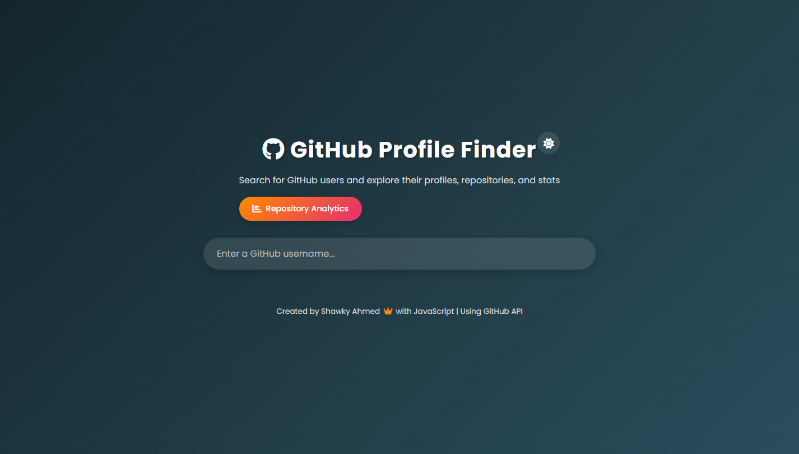

# GitHub Profile Finder



## 📋 Overview

GitHub Profile Finder is a web application that allows users to search for GitHub profiles and view detailed information about GitHub users. The application leverages the GitHub API to fetch and display user profiles, repositories, activity timelines, and analytics in an intuitive and visually appealing interface.

## Live Project

Live Project Link: [GitHub Profile Finder](https://qs3h.github.io/GitHub-Profile-Finder/)

## ✨ Features

- **User Search**: Quickly find GitHub users by username
- **Profile Display**: View comprehensive user profile information including bio, location, and social links
- **Activity Timeline**: Visualize a user's GitHub activity over time
- **Repository Analytics**: Analyze repository statistics such as stars, forks, and language distribution
- **Theme Management**: Switch between light and dark themes for comfortable viewing
- **Responsive Design**: Optimized for both desktop and mobile devices

## 🛠️ Technologies Used

- **HTML5**: Structure of the web application
- **CSS3**: Styling with responsive design principles
- **JavaScript**: Dynamic functionality and API interactions
- **GitHub API**: Data source for user profiles and repository information

## 🚀 Getting Started

### Prerequisites

- Modern web browser (Chrome, Firefox, Safari, Edge)
- Internet connection to access the GitHub API

### Installation

1. Clone the repository:

   ```bash
   git clone https://github.com/yourusername/github-profile-finder.git
   ```

2. Navigate to the project directory:

   ```bash
   cd github-profile-finder
   ```

3. Open `index.html` in your web browser:

   ```bash
   # On Windows
   start index.html

   # On macOS
   open index.html

   # On Linux
   xdg-open index.html
   ```

Alternatively, you can use a local development server like Live Server in Visual Studio Code.

## 📖 Usage

1. **Search for a User**:

   - Enter a GitHub username in the search field
   - Press Enter or click the search button
   - View the results displaying the user's profile information

2. **Explore User Details**:

   - Review basic profile information (avatar, name, bio, etc.)
   - Scroll down to see repositories, activity timeline, and analytics
   - Click on repository cards to view more details or visit the repository on GitHub

3. **Analyze Repository Data**:

   - View repository statistics and metrics
   - Sort repositories by different criteria (stars, forks, last updated)
   - Filter repositories by programming language or type

4. **Check Activity Timeline**:

   - Visualize the user's contribution history
   - Hover over timeline points to see detailed information about specific activities

5. **Change Theme**:
   - Toggle between light and dark modes using the theme switcher in the navigation bar

## 🧩 Project Structure

```
├── css/
│   ├── activity-timeline.css   # Styles for the activity timeline component
│   └── styles.css              # Main stylesheet for the application
├── js/
│   ├── activity-timeline.js    # Activity timeline functionality
│   ├── repo-analytics.js       # Repository analytics and visualization
│   ├── script.js               # Main application logic and API interactions
│   └── theme-manager.js        # Theme switching functionality
└── index.html                  # Main HTML file
```

## 🔄 API Usage

This application uses the GitHub REST API v3. Key endpoints used include:

- `/users/{username}` - Get a user's profile information
- `/users/{username}/repos` - List a user's repositories
- `/users/{username}/events` - Get a user's activity events

Note: GitHub API has rate limiting. Unauthenticated requests are limited to 60 requests per hour.

## 🎨 Customization

### Themes

The application comes with built-in light and dark themes. To customize:

1. Modify the color variables in `styles.css`
2. Add new theme options in `theme-manager.js`

### Adding New Features

To extend the application:

1. Create new JavaScript modules for additional functionality
2. Import them in the main `script.js` file
3. Update the UI in `index.html` and add corresponding styles

## 📱 Responsive Design

The application is designed to work on devices of all sizes:

- Desktop: Full-featured experience with detailed visualizations
- Tablet: Optimized layout with slightly condensed information
- Mobile: Streamlined interface focusing on core functionality

## 🤝 Contributing

Contributions are welcome! Here's how you can contribute:

1. Fork the repository
2. Create a feature branch (`git checkout -b feature/amazing-feature`)
3. Commit your changes (`git commit -m 'Add some amazing feature'`)
4. Push to the branch (`git push origin feature/amazing-feature`)
5. Open a Pull Request

Please ensure your code follows the existing style and includes appropriate documentation.

## 📄 License

This project is licensed under the MIT License - see the LICENSE file for details.

## 🙏 Acknowledgements

- [GitHub API Documentation](https://docs.github.com/en/rest)
- [Font Awesome](https://fontawesome.com/) for icons
- [Chart.js](https://www.chartjs.org/) for data visualization (if used)
